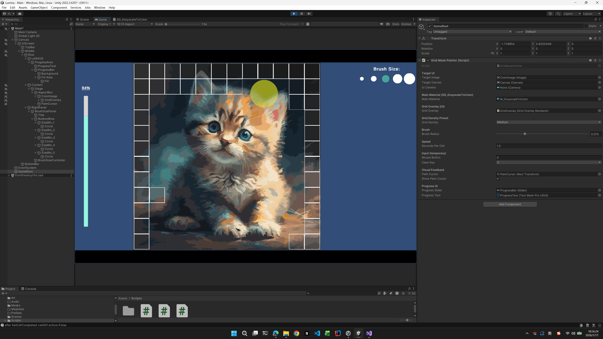

# Lumina
*Breath-Driven Oil Painting-Style Coloring Game*

---

## Overview

**Lumina** is a calm and accessible coloring game developed in **Unity**, designed to promote relaxation, focus, and emotional regulation through slow, intentional interaction.

The game uses the computer’s **camera as a motion input device**, detecting the user’s **hand and palm movement** to control the coloring process.  
Color is applied **gradually**, responding to hand coverage, movement, and rhythmic breathing rather than instantaneous clicks or gestures.

This approach encourages mindful interaction and reduces cognitive and emotional pressure.

---

## Download
You can download the pre-built binaries from **Releases**:
- Latest Release: Lumina v1.0.1 (Windows Standalone Build)

## Key Feature: Motion-Based Input

Unlike traditional mouse- or touch-based coloring games, **Color & Breathe** uses **vision-based motion input**:

- The user’s **hand is captured via the device camera**
- The system detects the **palm area and its movement**
- Coloring is applied to the image **based on the area covered by the hand**
- As the user moves their hand slowly and steadily, color fills the image progressively

This creates a **natural and embodied interaction**, allowing users to color without fine motor precision or complex controls.

---

## Target Audience

This game is designed for:

- Children with autism spectrum conditions
- Neurodivergent users who benefit from embodied, non-verbal interaction
- Users with limited fine motor control
- Educational and therapeutic environments
- Users seeking calming, screen-based activities

The design prioritizes **predictability**, **low sensory load**, and **non-judgmental feedback**.

---
## Technology Stack

- **Game Engine:** Unity 2022.3.62f3 LTS
- **Programming Language:** C#
- **Rendering:** 2D UI-based rendering
- **Platforms:**  
  - Windows (Standalone Build)  
  - WebGL (optional, depending on deployment)

---

## Project Structure (Development)

This repository contains the **Unity source project only**, intended for development and review.

Included:
- `Assets/`
- `Packages/`
- `ProjectSettings/`
- `UserContent/Lumina/`
  - `Images/` Users can create albums here to manage images they want to color.
  - `Saves/`  Save the image's coloring process data.
`

Playable builds are distributed separately.

---

## Core Gameplay Flow

1. **Image Selection**
   - The player selects a predefined image before starting.
   - The image remains fixed for the duration of the session.

2. **Difficulty Selection**
   - Difficulty is selected prior to gameplay:
     - **Low** – coarse grid, larger color regions
     - **Medium** – moderate grid density
     - **High** – fine grid, higher spatial precision
   - Difficulty controls the underlying grid resolution.

3. **Motion-Based Coloring**
   - The image is divided into a structured grid.
   - The player colors by moving their hand in front of the camera.
   - Color fills **gradually**, based on palm coverage and movement.

4. **Progress Feedback**
   - Visual indicators show overall completion.
   - Completed regions are clearly marked.
   - No time limits, scores, or failure states exist.

---

## Design Principles

- **Embodied Interaction**  
  Uses natural hand movement instead of abstract input devices.

- **Calm and Predictable Feedback**  
  No sudden changes, flashing elements, or punishment mechanics.

- **Accessibility-Oriented Design**  
  Suitable for users with diverse cognitive and motor abilities.

- **Process Over Outcome**  
  The act of slow coloring is the primary experience.

---

## Use Case

This project can be used as:

- A prototype for therapeutic or educational software
- A demonstration of accessible game design
- A foundation for further development in assistive or serious games

---

## Disclaimer

This project is intended for demonstration and educational purposes.  
It is not a medical device and does not replace professional therapy.

---

